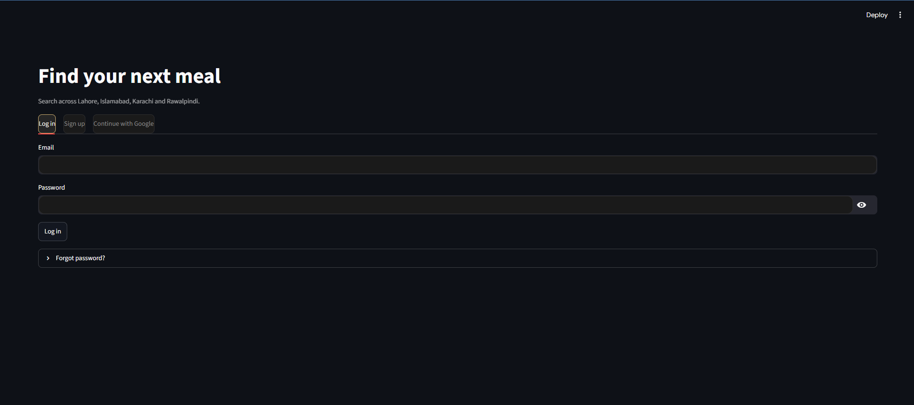

# 🍽️ Connoisseur — AI Restaurant Discovery for Pakistan

Production-grade AI backend for restaurant discovery across **Lahore, Islamabad, Karachi, and Rawalpindi**. Hybrid search, a 6-agent recommendation pipeline, persistent memory, full authentication (email/password + Google OAuth + 2FA), and clickable contact links.
---

## ScreenShot
Frontend is in streamlit simple and easy to understand and navigate




## Architecture

```
Data ingestion                    Storage                      Retrieval
──────────────                    ───────                      ─────────
Apify (bulk + backfill)   →      PostgreSQL (Neon)      →     BM25 (keyword)
OSM + Foursquare  →      ChromaDB × 3:           →     Dense (identity)
Google Places   →        restaurants                Review sentiment
                                     restaurant_reviews          Image (CLIP)
                                     restaurant_images      →   RRF fusion
                                                                      │
                                                                      ▼
                                                          6-agent recommendation
                                                          workflow (Groq/Gemini)
                                                                      │
                                                                      ▼
                                                    FastAPI (routers + services + auth)
                                                                      │
                                                                      ▼
                                                    Streamlit frontend (login-gated)
```


---

## Prerequisites

- Python 3.11+
- A PostgreSQL database (Neon or any Postgres works — the connection string uses `postgresql+asyncpg://`)
- Redis (used for sessions, rate limiting, login lockout, and every short-lived token: email verification, password reset, 2FA login, Google OAuth handoff)
- At minimum one of `GROQ_API_KEY` / `GOOGLE_API_KEY` for the LLM-based features (review summaries, the recommendation workflow)

---

## First-time setup

```powershell
# 1. Install dependencies
pip install -r requirements.txt

# 2. Configure environment
cp .env.example .env
# fill in NEON_DATABASE_URL, JWT_SECRET_KEY, and at least one LLM key

# 3. Apply auth + core schema migrations
alembic upgrade head

# 4. Create the remaining ingestion tables (ApifyRawSnapshot, ApifyRunLog —
#    not yet folded into an alembic migration)
python -c "
import asyncio
from backend.core.database import engine, Base
from backend.models import db_models

async def main():
    async with engine.begin() as conn:
        await conn.run_sync(Base.metadata.create_all)

asyncio.run(main())
"

# 5. Make sure Redis is running (any of these depending on your setup)
redis-server                  # if installed locally
# or: docker run -p 6379:6379 redis
```

---

## Running everything

`run.sh` already wraps the common cases:

```bash
bash run.sh
# 1) Backend API only     (uvicorn)
# 2) Frontend only        (streamlit)
# 3) Both (recommended)   (backend backgrounded, frontend in foreground)
# 4) MCP server only      (optional — see mcp_service/CLAUDE.md)
```

Or manually, in separate terminals:

```powershell
# Terminal 1 — backend
uvicorn backend.main:app --reload
# → http://localhost:8000, interactive docs at /docs

# Terminal 2 — frontend
streamlit run frontend/app.py
# → http://localhost:8501 — gated by login; register or "Continue with Google" first

# Terminal 3 — optional, only if you want MCP tool access (Claude Desktop, etc.)
python mcp_service/mcp_server.py
```

The frontend is now login-gated end to end (register/login/Google/2FA/password-reset/account-linking) — see `frontend/CLAUDE.md`. There's no data to search yet on a fresh database; do the ingestion steps below first.

### Getting an admin token

Ingestion endpoints require an admin account. Register normally through the API or the Streamlit app, then promote yourself directly in the database:

```powershell
# Register
$body = @{ email = "you@example.com"; password = "yourpassword123" } | ConvertTo-Json
Invoke-RestMethod -Uri "http://localhost:8000/auth/register" -Method Post -ContentType "application/json" -Body $body

# Verify email — the link prints to the uvicorn console if SMTP isn't configured;
# open it in a browser, or POST the token directly:
$verifyBody = @{ token = "PASTE_TOKEN_HERE" } | ConvertTo-Json
Invoke-RestMethod -Uri "http://localhost:8000/auth/verify-email" -Method Post -ContentType "application/json" -Body $verifyBody

# Promote to admin directly in the database
python -c "
import asyncio
from sqlalchemy import update
from backend.core.database import AsyncSessionLocal
from backend.models.db_models import User, UserRole

async def main():
    async with AsyncSessionLocal() as db:
        await db.execute(update(User).where(User.email == 'you@example.com').values(role=UserRole.admin))
        await db.commit()

asyncio.run(main())
"

# Log in
$loginBody = @{ email = "you@example.com"; password = "yourpassword123" } | ConvertTo-Json
$tokens = Invoke-RestMethod -Uri "http://localhost:8000/auth/login" -Method Post -ContentType "application/json" -Body $loginBody
$headers = @{ Authorization = "Bearer $($tokens.access_token)" }
```


---

## Environment variables

Full reference lives in `.env.example` — it's generated from `backend/core/config.py`'s actual `Settings` class, so trust the code over any doc (including this one) if they ever drift. Quick summary:

| Variable | Required? | Notes |
|---|---|---|
| `NEON_DATABASE_URL` | **Required** | `postgresql+asyncpg://...` |
| `JWT_SECRET_KEY` | **Required** | `python -c "import secrets; print(secrets.token_urlsafe(64))"` |
| `GROQ_API_KEY` / `GOOGLE_API_KEY` | At least one | LLM calls fall back Groq → Gemini automatically |
| `APIFY_API_TOKEN` | For Apify ingestion | apify.com, $5/mo free, no card |
| `FOURSQUARE_API_KEY` | Optional | Free tier is base search only |
| `GOOGLE_PLACES_API_KEY` | Optional | Needs a billing-enabled Google Cloud project |
| `GOOGLE_CLIENT_ID` / `SECRET` | For Google sign-in | console.cloud.google.com |
| `SMTP_HOST` etc. | Optional | Unset → verification/reset links print to console instead |
| `REDIS_URL` | Optional | Defaults to `redis://localhost:6379/0` |

---

## Ingesting restaurant data

### Check state before spending anything

```powershell
Invoke-RestMethod -Uri "http://localhost:8000/ingestion/n8n/apify-status" -Headers $headers        # DB volume, zero cost
Invoke-RestMethod -Uri "http://localhost:8000/ingestion/restaurants-missing-data" -Headers $headers # what's incomplete
Invoke-RestMethod -Uri "http://localhost:8000/ingestion/enrich-status" -Headers $headers            # reviews + photos + embeddings, all counts
Invoke-RestMethod -Uri "http://localhost:8000/ingestion/n8n/run-history" -Headers $headers          # past run duplicate ratios
```

### The main sync endpoint

```
POST /ingestion/n8n/sync-apify
```

| Param | Default | Notes |
|---|---|---|
| `cities` | all 4 | comma-separated |
| `per_city_limit` | 15 | applies **per search term**, not per city — matters in `cuisine-specific`/`neighborhood` modes |
| `search_mode` | `broad` | `broad \| cafes \| fastfood \| bakeries \| cuisine-specific \| neighborhood` |
| `max_reviews` | 5 | |
| `max_images` | 3 | URLs only at this stage — see embedding section below to actually embed them |
| `fill_missing` | `true` | backfills any empty field on existing restaurants instead of skipping them |

```powershell
Invoke-RestMethod -Uri "http://localhost:8000/ingestion/n8n/sync-apify?cities=Lahore&search_mode=neighborhood&per_city_limit=5&max_reviews=5&max_images=3&fill_missing=true" `
  -Method Post -Headers $headers
```

`search_mode` reference: `broad` saturates fastest — avoid repeating it on the same cities. `cuisine-specific` and `neighborhood` reset Google's ranking window and yield more genuinely-new restaurants; `neighborhood` is the highest-yield of all. `per_city_limit` multiplies by the number of search terms in these two modes, so keep it low (≤5) there.

---

## Embedding reviews and images in batches

Two independent batch jobs turn raw Postgres data into searchable vectors. Both are safe to re-run — already-embedded restaurants are skipped automatically, so you can call either repeatedly as new ingestion runs add more data.

### 1. Review summaries (LLM-based, always local-model-free either way)

Every review summary goes through Groq (primary) → Gemini (fallback) — there's no "local model" option here since it's a cautious-summarization task, not an embedding task; the summary text itself is then embedded with the same local `sentence-transformers` model used for restaurant identity.

```powershell
Invoke-RestMethod -Uri "http://localhost:8000/ingestion/summarise-all-reviews" -Method Post -Headers $headers
```

Restaurants with no reviews yet, or already summarised, are skipped. Check progress:

```powershell
Invoke-RestMethod -Uri "http://localhost:8000/ingestion/enrich-status" -Headers $headers
# → review_summaries_in_chroma
```

### 2. Image embedding — two paths, same underlying CLIP model

Both paths call the exact same `openai/clip-vit-base-patch32` model (loaded once, lazily, on first use — CPU by default, GPU automatically if `torch.cuda.is_available()`) and write into the same `restaurant_images` ChromaDB collection via `vector_store.upsert_restaurant_image()`. The only difference is where the image URL comes from.

**Path A — local/free (recommended default).** Uses the photo URLs Apify already gave you — no additional API call, no billing card, zero marginal cost beyond your own CPU time and bandwidth:

```powershell
# Test with a small batch first — the FIRST call in a fresh process
# downloads the ~600MB CLIP model, which is the slow part of a first run
Invoke-RestMethod -Uri "http://localhost:8000/ingestion/embed-restaurant-images?limit=10" -Method Post -Headers $headers

# Check it worked
Invoke-RestMethod -Uri "http://localhost:8000/ingestion/enrich-status" -Headers $headers
# → image_vectors_total should have gone up

# Run on everything once you're satisfied
Invoke-RestMethod -Uri "http://localhost:8000/ingestion/embed-restaurant-images" -Method Post -Headers $headers
```

**Path B — online/paid (Google Places).** Only worth using for restaurants that have *no* photo URLs at all yet (typically OSM/Foursquare-sourced restaurants, which never carry photos) — this path calls Google Places Details (~$0.017/restaurant, requires a billing-enabled key) to fetch photo references, download them, and embed them the same way:

```powershell
Invoke-RestMethod -Uri "http://localhost:8000/ingestion/enrich-reviews?limit=10&embed_images=true" -Method Post -Headers $headers
```

**If you'd rather not run CLIP locally at all** (e.g. deploying somewhere with no GPU and limited CPU/RAM), the alternative is swapping `vector_store.py`'s `embed_image_from_bytes`/`embed_text_clip` for a hosted multimodal embedding API — Google's Vertex AI multimodal embeddings are the most natural fit here since this project already depends on `google-genai`, but this isn't implemented; it would mean replacing those two functions' internals with an API call instead of a local model call, while keeping every caller (`upsert_restaurant_image`, `search_by_image_text`) untouched, since they only depend on getting back a same-length float vector.

---

## Ingestion endpoints — full reference

| Endpoint | Method | Purpose |
|---|---|---|
| `/ingestion/n8n/sync-apify` | POST | Main Apify ingestion (see above) |
| `/ingestion/embed-restaurant-images` | POST | Free local-CLIP image embedding (Path A above) |
| `/ingestion/summarise-all-reviews` | POST | LLM review summaries → embedded |
| `/ingestion/enrich-reviews` | POST | Google Places fallback: reviews + photos + image embedding (Path B above) |
| `/ingestion/enrich-existing-via-apify` | POST | Targeted re-scrape by placeId for restaurants missing data |
| `/ingestion/fetch-restaurants` | GET | OSM + Foursquare fetch (free, n8n calls this) |
| `/ingestion/restaurant-sync` | POST | Ingest any restaurant list → Postgres + ChromaDB + BM25 |
| `/ingestion/load-apify` | POST | One-time bulk load from `data/apify_export.json` |
| `/ingestion/n8n/apify-status` | GET | DB volume, zero cost |
| `/ingestion/n8n/run-history` | GET | Past run duplicate ratios |
| `/ingestion/restaurants-missing-data` | GET | Candidates for targeted re-scrape |
| `/ingestion/enrich-status` | GET | Full completeness dashboard: reviews, photos, summaries, **image vectors** |

All `/ingestion/*` endpoints require an admin token (`Authorization: Bearer ...`).

---

## Authentication — quick reference

Full design detail, Redis key namespaces, and security reasoning: `backend/services/auth/CLAUDE.md`. Endpoint list:

```
POST /auth/register                Email + password — sends a verification email, no tokens yet
POST /auth/login                   Returns tokens, or {mfa_required, mfa_token} if 2FA is on
POST /auth/login/verify-2fa        {mfa_token, code} → tokens
GET  /auth/verify-email            What the emailed link points at — verifies + redirects to frontend
POST /auth/verify-email            Same, for programmatic callers — returns tokens directly
POST /auth/resend-verification     Rate-limited 3/hr per email
POST /auth/forgot-password         Always 204 — never reveals whether the email exists
POST /auth/reset-password          Revokes every existing session on success
POST /auth/refresh                 Rotate a refresh token
POST /auth/logout                  Revoke one refresh token
GET  /auth/me                      Current user, including totp_enabled
POST /auth/deactivate              Soft-delete + revoke all sessions
GET  /auth/sessions                List active sessions (device/IP/created_at)
DELETE /auth/sessions/{jti}        Revoke one session
POST /auth/2fa/setup               Generate a TOTP secret (not yet enabled)
POST /auth/2fa/verify              Confirm a code → enable 2FA
POST /auth/2fa/disable             Requires password + a current code

GET  /auth/google/login            Get the Google consent URL
GET  /auth/google/callback         Google redirects here
POST /auth/google/exchange         {login_code} → tokens
POST /auth/google/link-confirm     {link_token, password} → tokens (account linking)
```

`/register` is rate-limited 5/hr per IP. `/login` locks an email out for 15 minutes after 5 failed attempts, checked before the database is even touched. Every meaningful event (register, login success/failure, logout, 2FA changes, deactivation) writes to the `audit_logs` table.

---

## Neon connection notes

```python
# backend/core/database.py
engine = create_async_engine(
    settings.NEON_DATABASE_URL,
    pool_pre_ping=True,
    pool_recycle=180,   # tightened after a real incident, see CLAUDE.md
)
```

Large ingestion runs can hold a DB session open long enough to hit Neon's idle-connection timeout mid-request, producing a `500` on the *response* even though every actual write already committed. If you see a `500` with `asyncpg.exceptions.InterfaceError` / "cannot call Transaction.rollback(): the underlying connection is closed" right after a log line showing a batch completed — that's a teardown-phase error, not data loss. Check `/ingestion/enrich-status` before assuming anything was lost.

---

## Data sources — comparison

| Source | Reviews | Photos | Card required | Cost |
|---|---|---|---|---|
| Apify Google Maps | ✅ (`maxReviews`) | ✅ URLs (`maxImages`) | ❌ No | $5/mo free, resets monthly |
| OpenStreetMap | ❌ | ❌ | ❌ No | Free, unlimited |
| Foursquare | ❌ (Premium-only) | ❌ (Premium-only) | No (base search) | Base free, reviews/photos paid |
| Google Places | ✅ | ✅ | ✅ Yes | $200/mo free credit |
| **CLIP image embedding** | — | Embeds URLs from any source above | ❌ No (local model) | Free — local compute only |

---
